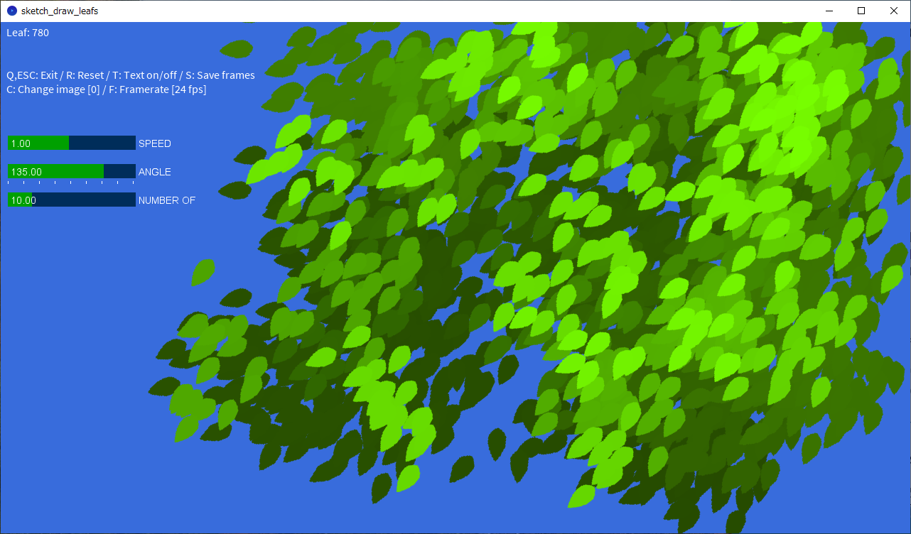

<!-- -*- encoding: utf-8 -*- -->

sketch\_draw\_leaves
====================

Processingで作成した葉っぱを揺らすサンプル。

Description
-----------

Processinとパーリンノイズで葉っぱ画像を揺らして、それらしく見えるか試してみました。

Screenshots
-----------

Environment / Requirement
-------------------------

以下の環境で動作確認しました。

* Windows10 x64 22H2 + Processing 4.3

動作には以下のライブラリが必要です。Processing 上で操作してインストールしてください。

* ControlP5

Usage
-----

* Processing で sketch\_draw\_leaves.pde を読み込んで実行してください。
* 葉っぱ画像として leaf.png と leaf2.png が必要です。.pde と同じ階層に置いてください。
* キャンバスの中でマウスクリックすれば葉っぱが配置されます。

### Shortcut keys

* Cキーで葉っぱ画像変更。
* Rキーでリセット。
* Fキーでフレームレートを、24、12、8FPSに変更。
* Sキーで、一連のフレームをアルファチャンネル付き連番画像として保存。frames/ 以下に保存される。
* ESCキーかQキーで終了。

License
-------

CC0 / Public Domain

Author
------

[mieki256](https://github.com/mieki256)

