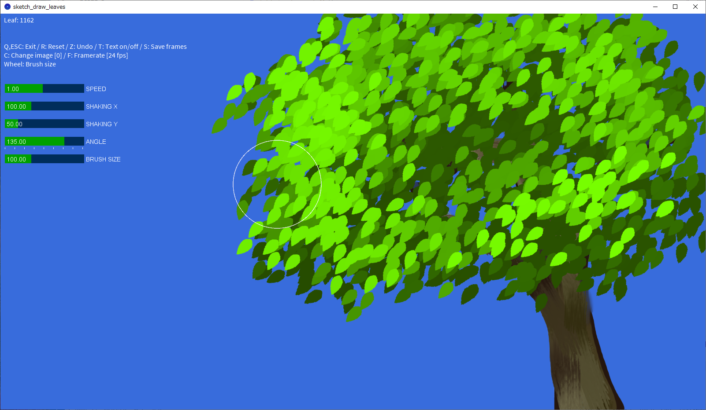

<!-- -*- encoding: utf-8 -*- -->

sketch\_draw\_leaves
====================

Processingで作成した葉っぱを揺らすサンプル。

Description
-----------

Processinとパーリンノイズで葉っぱ画像を揺らして、それらしく見えるか試してみました。

Screenshots
-----------

[Screenshot movie (YouTube)](https://youtu.be/GQ458NYrCw8)

Environment / Requirement
-------------------------

以下の環境で動作確認しました。

* Windows10 x64 22H2 + Processing 4.3

動作には以下のライブラリが必要です。Processing 上で操作してインストールしてください。

* ControlP5

Usage
-----

* Processing で sketch\_draw\_leaves.pde を読み込んで実行してください。
* 葉っぱ画像として leaf.png と leaf2.png、下絵画像として bg.png が必要です。data/ 以下に置いてください。
* キャンバス上でマウスボタンを押し続ければ葉っぱが配置されます。

### Shortcut keys

* Cキー : 葉っぱ画像変更。
* Zキー : Undo
* Fキー : フレームレートを、24, 12, 8 FPS に変更。
* Sキー : 一連のフレームをアルファチャンネル付き連番画像として保存。frames/ 以下に保存される。
* Hキー : 葉っぱ画像の色合いを生成時のまま固定するか、生成毎に自動ソートするか。
* Rキー : Reset
* Tキー : テキストメッセージ表示のON/OFF
* ESCキー, Qキー : Exit
* マウスホイール : ブラシサイズ(葉っぱ配置範囲)の変更

License
-------

CC0 / Public Domain

Author
------

[mieki256](https://github.com/mieki256)

